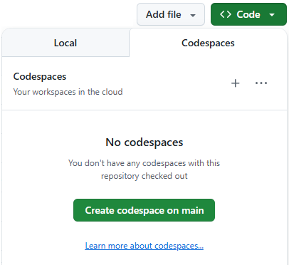
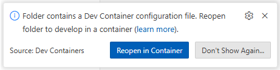

# Vector Application Framework - Community Edition

The Vector Application Framework - Community Edition offers a fast and straightforward solution for
design, development, and test of distributed automotive applications. It includes a comprehensive
API, a set of tools, and a complete workflow that enable you to rapidly build, integrate, and
maintain your application. The Community Edition at hand targets the Linux platform and supports
different communication use cases including intra-process as well as inter-process and network-based
communication via SOME/IP protocol.

---
⚠️ **Vector Application Framework - Community Edition SPECIFIC SPECIAL TERMS:**

​For Vector Application Framework - Community Edition, specific special terms apply and take
precedence over Vector’s Terms of Use for Free Software (see below). The product-specific special
terms can be viewed in the [LICENSE](LICENSE) file of this repository.

**By downloading this repository, included artifacts, or packages of Vector Application Framework -
Community Edition, you agree to these special terms.**

Please note: Vector Application Framework - Community Edition is available for non-commercial use
only, including research and development purposes, but not for use in production software. Using
Vector Application Framework - Community Edition for production and commercial purposes is
prohibited!

For production software options, please consider [Vector's Embedded Software
products](https://www.vector.com/us/en/products/products-a-z/embedded-software/) or consult your
[Vector sales contact](https://www.vector.com/us/en/company/contacts/).

---

## Prerequisites (w/ GitHub account)
If you have a GitHub account, there are no specific requirements to get started with Vector
Application Framework - Community Edition except for a web browser! Just click the **Code** icon in
the top right corner of this page and select **Create codespace on main** as illustrated below.

This will open a Microsoft Visual Studio Code instance in a Container that is based on the Docker
image as provided via Packages of this repository. All tools and dependencies of Vector Application
Framework - Community Edition are pre-installed, just ready to use!

>**ℹ️ Note** The initial creation of a Codespace takes a few moments, mainly due to the download of
> the Docker image. On subsequent access, previously created instances are still available and can
> be re-used. Even changes are persisted. That means, one can start a project and continue at any
> later point in time.

## Prerequisites (w/o GitHub account)

If you don't have a GitHub account or prefer to work directly on your local machine, we recommend
the following tool setup:
* Windows Subsystem for Linux (WSL 2) with Ubuntu 24.04 LTS (for Windows users only)
* Docker (recommended to install using the apt repository)
* Microsoft Visual Studio Code with *Dev Containers* extension

The following steps are needed to set up the environment locally:

1. Clone the repository to your local machine: `git clone https://github.com/vectorgrp/application-framework.git`
2. Open the just cloned folder in Visual Studio Code.
3. Wait for the prompt of the *Dev Containers* extension to re-open the folder in the container.

>**ℹ️ Note** The initial startup takes a few moments, mainly due to the download of
> the Docker image.
4. That is the setup complete. You are now ready to start with one of our provided examples in 📂 [Tutorials](Tutorials).

## Documentation
Learn more about motivation, concept, and building blocks of the Vector Application Framework by
reading the documentation as linked below. If you are interested in further material, for example an
API specification, please do not hesitate to [get in touch](https://www.vector.com/int/en/products/products-a-z/embedded-software/vector-application-framework/#c407863).

📓 [Read documentation](https://github.com/eclipse-autoapiframework/application-framework/blob/main/Documentation/README.md)

## Repository content

This Git repository is the starting point for your journey with the Vector Application Framework. It
represents the workspace for your projects and contains the following artifacts: 

* 📂 [.devcontainer](.devcontainer)
  * This folder contains the devcontainer JSON file that lists Docker image and all settings for
    direct use of this workspace with Codespaces and Microsoft Visual Studio Code respectively.
* 📂 [.vscode](.vscode)
  * Contains scripts and configuration files for Visual Studio Code.
* 📂 [Tutorials](Tutorials)
  * This directory contains step-by-step instructions for different examples that help you to get
    started with this bundle.
* 📄 [.vafconfig.json](.vafconfig.json)
  * Configuration file that labels this directory as workspace of the Vector Application Framework.
* 🔗 [Demo](Demo)
   * Symlink to the folder that contains the sample files for all examples as listed in the
     Tutorials section. Target location of this link is only available in the container.
* 📄 [LICENSE](LICENSE)
  * The LICENSE file contains the terms of use for the Vector Application Framework - Community
    Edition.
* 📄 [README.md](README.md)
  * General introduction to the Vector Application Framework - Community Edition repository and
    overview of its contents.
* 📄 [SECURITY.md](SECURITY.md)
  * Security policy of this project.
