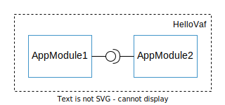

# "Hello, world!" demo with the Vector Application Framework

The Vector Application Framework (VAF) supports three different project types, *interface project*,
*app-module project*, and *integration project*. These project types are useful for handling large
projects with distributed development teams. In this `Hello, world!` demo, we will introduce those
project types and realize a simple modular application that consists from one executable only.

The figure below provides a schematic illustration of the example at hand to give you an overview of
its building blocks:



`AppModule1` provides a communication interface that is used by `AppModule2`.

The first application module periodically sends a message of the format `Hello, VAF! - MsgID: <ID>`
to the second application module. The second module subscribes to message changes and prints new
messages on the terminal. It uses an operation to periodically change the MsgID of the first
application module, which is part of the changed message.

## Project setup

To get started, we will create an integration project. This project type defines the executables of
the application. It can contain application module projects or import external ones. For the
simplicity of this demo, we will use the first option.

Open your VAF workspace in the devcontainer and create the required projects by using the following
CLI commands:

``` bash
vaf project init integration
Enter your project name: HelloVaf

cd HelloVaf

vaf project create app-module
Enter the name of the app-module: AppModule1
Enter the namespace of the app-module: demo

vaf project create app-module
Enter the name of the app-module: AppModule2
Enter the namespace of the app-module: demo
```

>**ℹ️ Hint**  
> If you're using VS Code, you can also use the tasks provided by the VAF extension instead of
> typing the CLI commands. You don't have to switch directories to do this, just select the project
> you want to run a task for in the `VAF Navigation` view and run a task from the `VAF Tasks` view.

The above commands create the structure of the corresponding projects. The application module
projects are stored in the `src/application_modules` directory of the integration project.

## Definition of interfaces

To describe the communication between the application modules, we define a communication interface.
This can be done in the Configuration as Code (CaC) file of the app-modules. Extend the
`app_module1.py` file in the model folder of the first app-module:

``` python
interface = vafpy.ModuleInterface(name="HelloWorldIf", namespace="demo")
interface.add_data_element("Message", datatype=BaseTypes.STRING)
interface.add_operation("SetMsgId", in_parameter={"MsgId": BaseTypes.UINT8_T})
```

This defines a simple interface containing a data element (`Message`) and an operation (`SetMsgId`).

To be able to use this interface in both app-modules, copy the interface definition to the
corresponding CaC file of the second application module.

## Configuration of application modules

The next step is to configure the behavior of both app-modules. For `AppModule1`, modify the
generated template of the CaC file to add the above defined interface and a periodically executed
task to the application module:

``` python
app_module1 = vafpy.ApplicationModule(name="AppModule1", namespace="demo")
app_module1.add_provided_interface("HelloWorldProvider", interface)

periodic_task = vafpy.Task(name="PeriodicTask", period=timedelta(milliseconds=500))
app_module1.add_task(task=periodic_task)
```

The CaC changes for `AppModule2` are similar. Note the difference in the interface direction and the
task period:

``` python
app_module2 = vafpy.ApplicationModule(name="AppModule2", namespace="demo")
app_module2.add_consumed_interface("HelloWorldConsumer", interface)

periodic_task = vafpy.Task(name="PeriodicTask", period=timedelta(milliseconds=1000))
app_module2.add_task(task=periodic_task)
```

The next step is to start the code generation for both app-modules. Change to the appropriate
project directory in `src/application_modules` and run:

``` bash
vaf project generate
```

>**ℹ️ Note**  
> By default, the MSRA generators are used to generate the C++ datatypes. This can take quite a long
> time. For a faster generation result, you can use the CLI flag `-t STD` to switch to datatype
> generation based on the standard library. Be sure to use the same generation type for all projects
> that contribute to an executable.

This step provides the implementation stubs in the `implementation` subdirectory of the app-module
projects. It also configures CMake with a release and debug preset to enable the use of the VS Code
CMake Tools extension and IntelliSense features.

### Implementation of business logic

To realize the behavior as described in the introduction, we implement the periodic tasks of both
app-modules, add an operation handler to `AppModule1`, and register a data element handler in
`AppModule2`.

In the first app-module, add the following snippet to the constructor:

``` cpp
HelloWorldProvider_->RegisterOperationHandler_SetMsgId(
    [this](const std::uint8_t& msg_id) { msg_id_ = static_cast<uint8_t>(msg_id); }
);
```

And a simple method call to the periodic task:

``` cpp
std::string myMsg = "Hello, VAF! - MsgID: " + std::to_string(msg_id_);
HelloWorldProvider_->Set_Message(myMsg.c_str());
```

Additionally, a member attribute must be defined in the corresponding header file:

``` cpp
 private:
  uint8_t msg_id_;
```

In the constructor of the second app-module, register the data element handler:

``` cpp
HelloWorldConsumer_->RegisterDataElementHandler_Message(
    GetName(),
    [](const auto& hello_text) { vaf::OutputSyncStream{} << "Received: " << *hello_text << std::endl; }
);
```

>**ℹ️ Note**  
> Instead of using `vaf::OutputSyncStream` you can also make use of `std::cout`. The synchronized
> output stream is provided by the Application Framework to allow synchronized output to stdout
> without any overlapping. This is especially helpful in bigger projects with multiple executables
> and included app-modules.

And modify the periodic task to include the following snippet:

``` cpp
static uint8_t msg_id = 0;
HelloWorldConsumer_->SetMsgId(msg_id++);
```

Add the necessary include directives as needed, for example `#include "vaf/output_sync_stream.h"` in
`app_module2.cpp`.

>**ℹ️ Note**  
> To check for compilation errors, you can compile the app-modules into static libraries using `vaf
> make build` inside of the project directory.

## Configuration of the executable

Returning to the integration project, both application modules can now be connected to the
executable. Before you do this, you need to apply the model changes from the application module
projects to the integration project:

``` bash
vaf model update
```

Select both application modules in the interactive dialog.

Now, the CaC file of the integration project `model/vaf/hello_vaf.py` can be extended:

``` python
# Create executable instances (or configure existing ones from the platform configuration)
executable = Executable("HelloVaf")

# Add application modules to executable instances
executable.add_application_module(AppModule1, [(Instances.AppModule1.Tasks.PeriodicTask, timedelta(milliseconds=10), 0)])
executable.add_application_module(AppModule2, [(Instances.AppModule2.Tasks.PeriodicTask, timedelta(milliseconds=10), 1)])
```

The above config snippet adds the app-modules to the executable, enables their tasks, and sets them
with a time budget of 10 ms and their preferred execution order.

Next, connect the interfaces of the two application modules:

``` python
# Connect the internal application module instances
executable.connect_interfaces(
    AppModule1,
    Instances.AppModule1.ProvidedInterfaces.HelloWorldProvider,
    AppModule2,
    Instances.AppModule2.ConsumedInterfaces.HelloWorldConsumer,
)
```

Now, the project is completely configured. The remaining source code can be generated and the
executable can be built:

``` bash
vaf project generate
vaf make install
```

>**ℹ️ Note**  
> If something changes in any sub-project of an integration project, the entire integration project
> with all it's dependencies can be regenerated using `vaf project generate --mode all`. This also
> includes the `vaf model update` command mentioned at the beginning of this section.

## Running the application

Set up your environment using the `setup.sh` script that is provided in the root directory of your
integration project. It will set the necessary environment variables.

``` bash
source setup.sh
```

Run the executable located in the `build/<build_type>/install/opt` directory:

``` bash
cd build/Release/install/opt/HelloVaf/
./bin/HelloVaf
```

You should see the following output on your terminal:

```
UserController::PreInitialize
ExecutableControllerBase::ChangeStateOfModule: name HelloWorldIfModule state: kNotOperational
ExecutableControllerBase::ChangeStateOfModule: name AppModule1 state: kNotOperational
ExecutableControllerBase::ChangeStateOfModule: name AppModule2 state: kNotOperational
UserController::PostInitialize
UserController::PreStart
ExecutableControllerBase::ChangeStateOfModule: name HelloWorldIfModule state: kStarting
ExecutableControllerBase::ChangeStateOfModule: name HelloWorldIfModule state: kOperational
ExecutableControllerBase::ChangeStateOfModule: name AppModule1 state: kStarting
ExecutableControllerBase::ChangeStateOfModule: name AppModule1 state: kOperational
UserController::PostStart
ExecutableControllerBase::ChangeStateOfModule: name AppModule2 state: kStarting
ExecutableControllerBase::ChangeStateOfModule: name AppModule2 state: kOperational
Received: Hello, VAF! - MsgID: 0
Received: Hello, VAF! - MsgID: 0
Received: Hello, VAF! - MsgID: 1
Received: Hello, VAF! - MsgID: 1
Received: Hello, VAF! - MsgID: 2
Received: Hello, VAF! - MsgID: 2
Received: Hello, VAF! - MsgID: 3
...
```

## Introduction to Interface Projects

To avoid the duplicated definition of datatypes and interfaces in the configuration of each
application module that wants to use them, one can use an *interface project* instead. Projects of
this type can be used to define communication interfaces in a central location. Application module
projects can then import these interfaces to use their definitions.

To use this concept in this demo, create a new interface project in your workspace:

``` bash
vaf project init interface
Enter your project name: HelloInterfaces
```

To specify the interfaces extend the generated `hello_interfaces.py` file:

``` python
interface = vafpy.ModuleInterface(name="HelloWorldIf", namespace="demo")
interface.add_data_element("Message", datatype=BaseTypes.STRING)
interface.add_operation("SetMsgId", in_parameter={"MsgId": BaseTypes.UINT8_T})
```

Generate the exchange format of the interface definition:

``` bash
vaf model generate
```

Then, in the directory of each application module project, run the following command to import the
interface project and choose the path to the `HelloInterfaces/export/HelloInterfaces.json` file in
the interactive prompt:

``` bash
vaf project import
```

The interface definition can now be removed from both app module configurations. Instead, the
following line must be uncommented:

``` python
from .imported_models import *
```

The interface can now be used through the imported CaC helper:

``` python
app_module1.add_provided_interface("HelloWorldProvider", hello_interfaces.Demo.hello_world_if)
```

After all changes in both app-modules have been made, the executable can be rebuilt by going to the
integration project directory and running the following commands:

``` bash
vaf project generate --mode all
vaf make install
```
