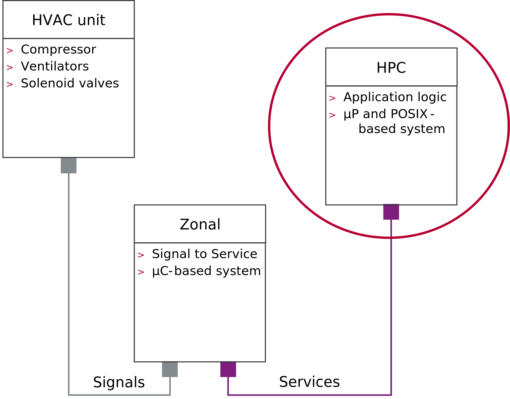

# HVAC demo

The HVAC demo is a simple example to illustrate the usage of the **Vector Application Framework (VAF)**.

 
The scenario for this demo is a control application for an HVAC (heating, ventilation, air
conditioning) unit. The HVAC unit itself is located somewhere in the vehicle and most likely
connected to a bus system. The steering application instead is supposed to be executed on an HPC
system. Some ECU or middleware stack sitting in between is taking care of the signal to service
conversion and vice versa such that the application can be implemented based on the service-oriented
paradigm with pub/sub messaging and remote procedure calls (RPC).
