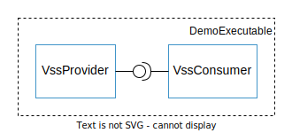

# Vector Application Framework - using the COVESA VSS catalog

The following tutorial guides you through an example with the **Vector Application Framework (VAF)**
that illustrates how interfaces from the COVESA Vehicle Signal Specification (VSS) can be derived
and used.

## DemoExecutable
Plan in this demo is to develop one executable with two application modules. The example does not
use a platform for communication, the app-modules only communicate directly. That means, they share
an internal communication channel, which is based on VSS. A high-level illustration of this setup is
given below:



To get started, first create a new integration project using the VAF command line tool:

``` bash
vaf project init integration
Enter your project name: DemoExecutable
```

Next, switch folders:
``` bash
cd DemoExecutable
```

### Configuration and implementation of app-modules

Add two application modules to the project using:

``` bash
vaf project create app-module
Enter the name of the app-module: VssProvider
Enter the namespace of the app-module: demo

vaf project create app-module
Enter the name of the app-module: VssConsumer
Enter the namespace of the app-module: demo
```

Next, switch folders accordingly:
``` bash
cd src/application_modules/vss_<consumer/provider>
```

Then, import the VSS data catalogue to the project. The sample VSS catalogue is shipped as JSON file
and is part of the container. It is located in: `/opt/vaf/Demo/VssDemo/model/vss/vss.json`.
``` bash
vaf model import vss
Enter the path to the VSS catalogue file in JSON format /opt/vaf/Demo/VssDemo/model/vss/vss.json
```

Two new files are added to the project folder by this command. `vss-derived-model.json` is the VAF
model file in JSON format. It contains all relevant information as imported from the VSS catalogue.
`vss.py` is the Configuration as Code (CaC) support, which is needed to access the model artifacts
from the Python configuration.

Next step is the configuration of the app-module in `./model/vss_<consumer/provider>.py`. 

To import the interfaces from the previous step, write:
``` python
from .vss import *
```

The app-module configuration template already contains the app-module object and a default task. On
top, the interface definitions need to be added.

For the VssConsumer use:
``` python
vss_consumer = vafpy.ApplicationModule(name="VssConsumer", namespace="demo")

vss_consumer.add_consumed_interface("AccelerationConsumer", interface=Vss.Vehicle.acceleration_if)
vss_consumer.add_consumed_interface("DriverConsumer", interface=Vss.Vehicle.driver_if)

periodic_task = vafpy.Task(name="PeriodicTask", period=timedelta(milliseconds=200))
vss_consumer.add_task(task=periodic_task)
```

For the VssProvider use:
``` python
vss_provider = vafpy.ApplicationModule(name="VssProvider", namespace="demo")

vss_provider.add_provided_interface("AccelerationProvider", interface=Vss.Vehicle.acceleration_if)
vss_provider.add_provided_interface("DriverProvider", interface=Vss.Vehicle.driver_if)

periodic_task = vafpy.Task(name="PeriodicTask", period=timedelta(milliseconds=200))
vss_provider.add_task(task=periodic_task)
```

Continue from here with model and code generation:
``` bash
vaf project generate
```

Some sample code for the app-modules is provided for reference in: `/opt/vaf/Demo/VssDemo/src/vss_<consumer/provider>/vss_<consumer/provider>.cpp`.
Feel free to copy it to the generated implementation stubs in: `./implementation/src/vss_<consumer/provider>.cpp`

Finally, check if the app-module library compiles using:
``` bash
vaf make build
```

With this part completed for both, the VssProvider and the VssConsumer, the final integration on
executable-level can be started.

### Executable integration
Back in the integration project, plan is to define one executable with one instance of the
above-created app-modules each. 

Before we can start with the configuration, the changes from the application module projects need to
be updated, such that the configuration is available in the integration project. To do so, use the
following command and select both app-modules from the selection.
``` bash
cd <path-to-integration-project>
vaf model update
```

Continuing with the configuration in `./model/vaf/demo_executable.py`, we first define and configure one
executable as follows:
``` python
executable = Executable("DemoExecutable", timedelta(milliseconds=10))
```

Next, we can directly continue with the step of instantiating and adding app-modules as follows:
``` python
executable.add_application_module(VssProvider, [(Instances.VssProvider.Tasks.PeriodicTask, timedelta(milliseconds=1), 0)])
executable.add_application_module(VssConsumer, [(Instances.VssConsumer.Tasks.PeriodicTask, timedelta(milliseconds=1), 1)])
```

The second parameter, allows the definition of an integration-specific task mapping. This includes
the task period and execution order and allows the integrator to overrule the original settings from
the application module project. In this example, we want the provider to be executed before the consumer.

The two app-modules instances now can be connected as follows:
``` python
executable.connect_interfaces(VssProvider, Instances.VssProvider.ProvidedInterfaces.AccelerationProvider,
                              VssConsumer, Instances.VssConsumer.ConsumedInterfaces.AccelerationConsumer)
executable.connect_interfaces(VssProvider, Instances.VssProvider.ProvidedInterfaces.DriverProvider,
                              VssConsumer, Instances.VssConsumer.ConsumedInterfaces.DriverConsumer)
```

With this, the configuration part in the integration project is complete. Model and integration code
can be generated in one step using:
``` bash
vaf project generate
```

To complete the demo, compilation of the executable binary is missing.
``` bash
vaf make build
vaf make install
```

## Running the application
Before the binary can be started, the `setup.sh` script as provided in the top-level folder of the
integration project needs to be executed.
``` bash
source setup.sh
```
Afterwards, the binary can be run from the `./build/Release/install/opt/DemoExecutable` directory:
``` bash
./bin/DemoExecutable
```
